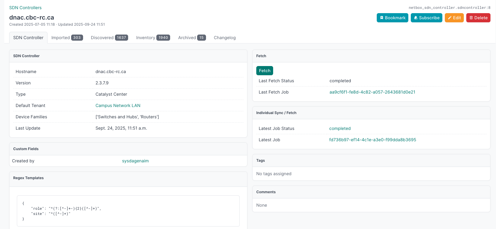
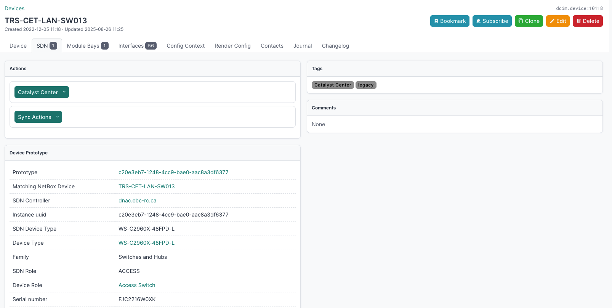
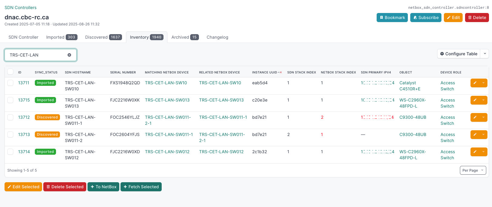
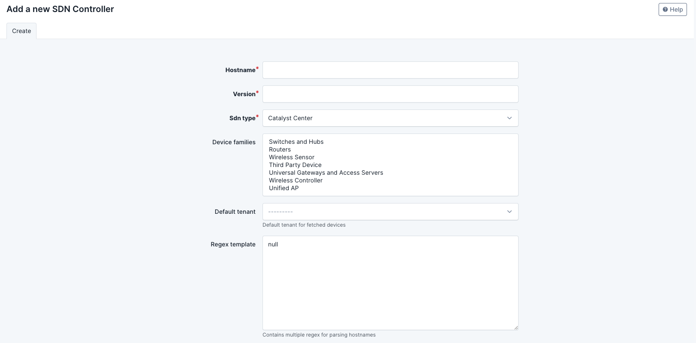
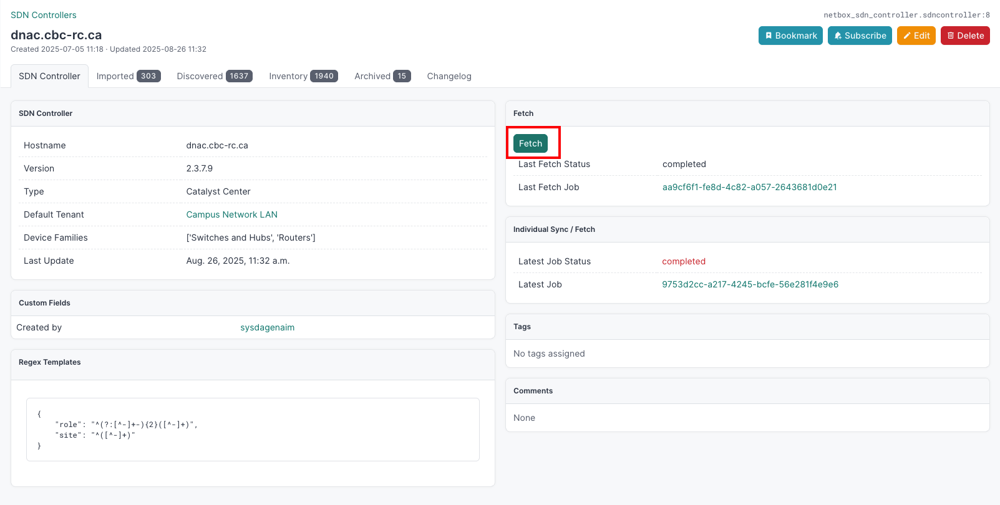
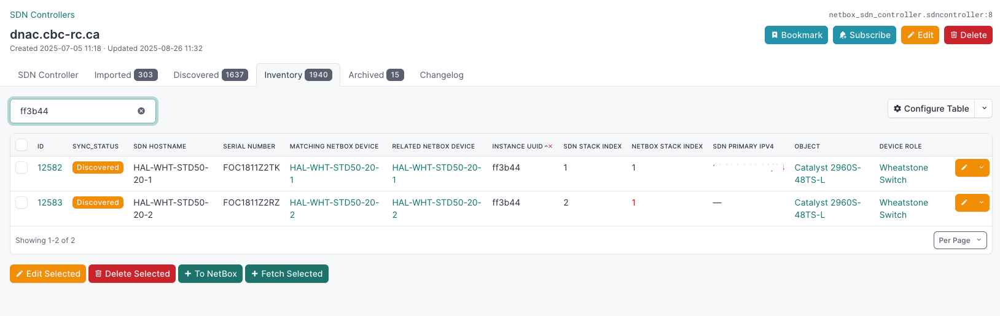
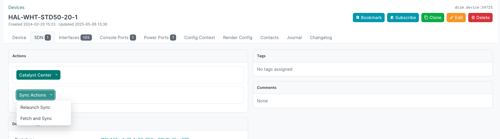

# Netbox SDN Controller Plugin

### Synchronize data between the Cisco Catalyst Center and NetBox.


## Preview





## Install

Place the code in the extras/plugins/ folder

Once installed, the plugin needs to be enabled in your `configuration.py`:
```no-highlight
vim /opt/netbox/netbox/netbox/configuration.py
```

```python
PLUGINS = ["netbox_sdn_controller"]
```

Install the following packages in your virtual environment with pip install.

```
dnacentersdk >= 2.8.3
netutils==1.14.1
```
Put the credentials for your Cisco Catalyst Center API in your environment variables.

Example:
```
DNAC_USER=my_user
DNAC_PASSWORD=my_psswd
```
Restart NetBox.

Run:
```bash
python3 manage.py migrate
```

### Versions

> [!NOTE]  
> If the version of netbox is not listed here the plugin will most likely not work. Remove the plugin if you want to update netbox before this plugin has released an update for that netbox version.


| netbox version | netbox-sdn-controller version | Cisco Catalyst Center API Version  |
|----------------|-------------------------------|------------------------------------|
| = 4.3.6        | = v1.4.2                      | 2.3.7.6 - 2.3.7.9                  |

## Data set

In order to correctly import interfaces associated with Cisco modules, it is important to modify their templates. The {chassis} variable, similar to {module} but not natively supported by NetBox, must take the first position. The same mechanism should be implemented soon for devices.


## Use


Go to the plugins tab in the navbar and click Add in SDN Controllers or go to `$NETBOX_URL/plugins/netbox-sdn-controller/sdn-controller/add/` to add your sdn controller





### You must fill in the required fields:


<dl>
    <dt>Hostname</dt>
    <dd>The Sdn Controller hostname as in https://{hostname}/ for the api's base url</dd>
    <dt>Version</dt>
    <dd>The api's version. For example, 2.3.7.9 in Catalyst Center</dd>
    <dt>Sdn Type</dt>
    <dd>Right now, the default type is Catalyst Center. This is the only type implemented so far</dd>

</dl>


### Optional fields:

<dl>
    <dt>Device Families</dt>
    <dd>Select the desired families. No selection means all families</dd>
    <dt>Default Tenant</dt>
    <dd>The default tenant for devices that do not exist in NetBox. Can then be edited by a user</dd>
    <dt>Regex Template</dt>
    <dd>Regex rule to determine the site and device role from the hostname.</dd>

</dl>


### You can now start your first import by clicking on 'Fetch'




### After correcting the errors mentioned in the reports, you can restart the synchronization either by multi-selecting in the list or directly from the SDN tab of the current device





## License

This project is licensed to you under the terms of the [Apache License, Version 2.0](./LICENSE).